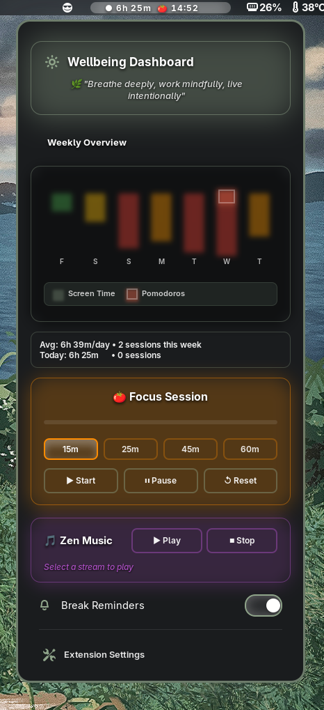

# Screen Time Widget

A simplified fork of the Wellbeing Widget focused exclusively on screen time tracking for GNOME Shell. This version removes the pomodoro timer, music player, and motivational quotes, providing a clean and minimal screen time tracking experience with system theme styling.

> **Note:** This is a fork of the [original Wellbeing Widget](https://github.com/mH-13/wellbeing-widget). The original includes additional features like pomodoro timer, zen music player, and more. This fork simplifies the extension to focus solely on screen time tracking.

## What This Fork Changes

- ✅ **Simplified to screen time only** - Removed pomodoro timer, music player, and motivational quotes
- ✅ **System theme styling** - Uses GNOME's native theme colors instead of custom vibrant styling
- ✅ **Cleaner UI** - Simplified menu with just screen time statistics and weekly overview
- ✅ **New extension UUID** - Uses `screentime-simple@local` to avoid conflicts with the original

[](https://gitlab.gnome.org/GNOME/gnome-shell)
[](LICENSE)
[]()




## Features

### Screen Time Tracking
Integrates with GNOME's native session tracking to provide accurate, privacy-respecting usage statistics. Data persists across reboots through GSettings storage.

- Real-time tracking with 5-second update intervals
- Color-coded weekly history (green to red based on usage)
- Efficient calculation: only updates current day, historical data cached
- Automatic midnight transitions

### Focus Sessions (Pomodoro Timer)
Streamlined timer with inline duration controls (15/25/45/60 minutes). Visual progress bar and audio alerts help maintain focus.

- One-second precision countdown
- Visual and audio completion notifications
- Break reminder system (configurable)
- Session statistics tracking

### Zen Music Player
Built-in lofi music streaming with animated equalizer visualization. Requires `mpv` player (optional dependency).

- Real-time 3-bar equalizer animation
- Process management with proper cleanup
- Priority system: timer display takes precedence in panel

### Interactive Statistics
Hoverable bar graphs display weekly patterns with detailed tooltips showing date, time, and completed sessions.

- Smooth fade animations
- Color-coded bars by usage level
- No layout glitches or jarring transitions

### Vibrant Sage Theme
Professional color palette with energetic yellow/orange gradients and calming sage green accents, designed for visual clarity and motivation.

- High contrast for readability
- Dynamic color-coded status indicators (yellow to red based on usage)
- Smooth gradients and animations with GPU acceleration


## Installation

### From GNOME Extensions Website

1. Visit [extensions.gnome.org](https://extensions.gnome.org/) (pending approval)
2. Search for "Wellbeing Widget"
3. Click "Install"
4. **Optional:** Install `mpv` for zen music (see below)

### Manual Installation

See [BUILD.md](BUILD.md) for development setup and build instructions.


## Optional: Zen Music

The zen music player requires `mpv`:

```bash
# Fedora / RHEL / CentOS
sudo dnf install mpv

# Ubuntu / Debian / Pop!_OS
sudo apt install mpv

# Arch Linux / Manjaro
sudo pacman -S mpv

# openSUSE
sudo zypper install mpv
```

After installing, restart GNOME Shell (logout/login or `Alt+F2` → `r` on X11).


## Usage

### Panel Indicator

- **Compact (100px):** `4h 23m` - Normal state
- **Expanded (160px):** `4h 23m  🍅 24:35` - Active timer
- **Music mode (160px):** `4h 23m  ▇▅▃ Zen` - Streaming audio

### Dropdown Menu

1. **Wellbeing Dashboard** - Header with hourly rotating quote
2. **Weekly Overview** - Interactive graph (hover bars for details)
3. **Statistics Summary** - Average daily metrics
4. **Focus Session** - Duration selector and control buttons
5. **Zen Music** - Play/stop controls for lofi streaming
6. **Break Reminders** - Toggle for periodic notifications
7. **Extension Settings** - Quick access to preferences

## Configuration

Access settings via Extensions app or:

```bash
gnome-extensions prefs screentime@mehedi.io
```

**Available options:**
- Pomodoro duration (5-60 minutes)
- Break intervals (short: 1-15 min, long: 10-30 min)
- Audio/visual alert preferences
- Break reminder frequency (default: 30 min)
- Data management (clear statistics)

## Troubleshooting

### Extension not visible in panel

```bash
gnome-extensions-app  # Toggle "Wellbeing Widget" on
# If still missing, logout/login
```

### Music player doesn't start

```bash
which mpv  # Should output: /usr/bin/mpv
# If missing, install mpv and restart GNOME Shell
```

### Statistics show "No data"

Statistics accumulate over time. Continue using your computer - data appears automatically within 24 hours.

### Extension shows ERROR state

```bash
gnome-extensions disable screentime@mehedi.io
rm -rf ~/.cache/gnome-shell/*
# Logout and login
gnome-extensions enable screentime@mehedi.io
```

## Technical Details

### Stack

- **Language:** Modern JavaScript (ES6+) with GJS bindings
- **UI Framework:** St (Shell Toolkit), Clutter for animations
- **State Management:** GSettings for persistent storage
- **Data Source:** GNOME Shell session tracking (privacy-respecting)
- **Audio:** mpv command-line player (optional)

### Architecture

- Modular single-file structure with clear function separation
- Graceful error handling with fallbacks for missing dependencies
- Proper resource cleanup in `destroy()` method
- 5-second update intervals balance freshness with CPU efficiency
- 100% async file operations (no shell blocking)

### Performance

| Metric | Value |
|--------|-------|
| **CPU Usage** | <1% |
| **Memory** | <10MB |
| **Update Interval** | 5 seconds |
| **File Size** | ~60KB |
| **Historical Data** | 85% faster calculation |


## Requirements

| Requirement | Details |
|-------------|---------|
| **GNOME Shell** | 45, 46, 47, 48, 49 |
| **Platform** | Linux (all major distributions) |
| **Dependencies** | `glib2`, `gnome-shell` |
| **Optional** | `mpv` (for zen music) |
| **Tested on** | Fedora 43 (GNOME 49), Ubuntu 24.04 (GNOME 47) |


## Contributing

- **Source Code:** [GitHub Repository](https://github.com/mH-13/wellbeing-widget)
- **Issue Tracker:** [Bug Reports & Feature Requests](https://github.com/mH-13/wellbeing-widget/issues)
- **Build Guide:** [BUILD.md](BUILD.md)
- **Discussions:** [Community Forum](https://github.com/mH-13/wellbeing-widget/discussions)

Contributions welcome. This project demonstrates clean code architecture, user-centered design, and modern JavaScript practices.


## License

**GNU General Public License v2.0 or later** ([LICENSE](LICENSE))

Free and open source. You may use, modify, and distribute this software. Any modifications must also be open source under GPL-2.0+.


## About

**Mehedi Hasan** - [@mH-13](https://github.com/mH-13)

Built to enhance digital wellbeing and productivity through thoughtful design and clean implementation.

**Skills demonstrated:**
- GJS/GNOME Shell extension development
- Modern JavaScript (ES6+, async/await)
- UI/UX design and user research
- Performance optimization
- Accessibility considerations

---

<div align="center">

**[Star on GitHub](https://github.com/mH-13/wellbeing-widget)** • **[Report Bug](https://github.com/mH-13/wellbeing-widget/issues)** • **[Request Feature](https://github.com/mH-13/wellbeing-widget/discussions)**

*Supporting digital wellbeing, one extension at a time*

</div>
